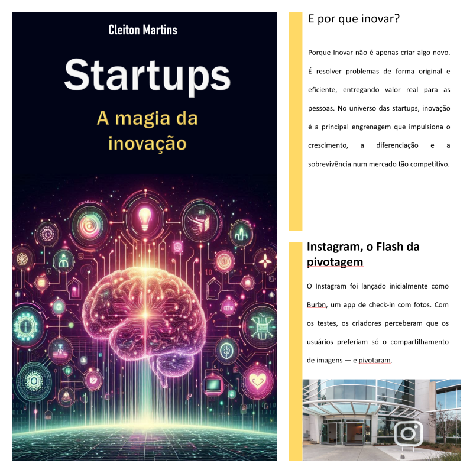

    

-------

# Projeto EBOOK Gerado por I.A.s

 > ℹ️ **NOTE:** Este é o repositório desenvolvido durante o curso no qual fui aluno na plataforma da [DIO](https://dio.me)

Projeto com o objetivo de gerar um ebook digital com as facilidades das ferramentas de IA. todos os prompts
seguem abaixo.

<a href="https://github.com/Cleit0nAlex/prompts-recipe-to-create-a-ebook/blob/main/output/Startups.pdf" title="View PDF now"> 📕Clique aqui para ler</a>

## 💻 Tecnologias utilizadas no projeto

- [ChatGPT](https://chat.openai.com/) 
- [PowerPoint](https://www.microsoft.com/en/microsoft-365/powerpoint)
- [Copilot](https://copilot.microsoft.com)

## 🧠 Prompts

ChatGPT：

|   Ação   | prompt                                                                                                                                                                                                                                                                         |
| :------: | ------------------------------------------------------------------------------------------------------------------------------------------------------------------------------------------------------------------------------------------------------------------------------ |
|  título  | crie um título de um ebook sobre o tema inovação, o ebook é para o nicho de empreendedores e o subnicho é de startups, o título deve ser impactante e curto, e que tenha uma temática tecnológica e inovadora. Ao final, liste-me 5 variações de títulos                                                        |

Copilot：

|  Ação  | prompt                                                                                 |
| :----: | -------------------------------------------------------------------------------------- |
|  capa  | Gere uma imagem para a capa de um ebook. A imagem deve ter um cérebro tecnológico, com ramificações neurais para os maiores problemas que a tecnologia pode resolver e no plano de fundo vários códigos, pode ser hexadecimais. O tema deve ter total concordância com o título escolhido por mim que foi o "Startup: A magia da inovação". Segue uma imagem como exemplo a ser gerado.
| conteúdo | Faça um texto para ebook, com foco em inovação para Startups, listando as principais características de inovação que uma startup deve ter para que se tenha sucesso
[REGRAS]
- Dê uma introdução sobre o que é inovação
- Escreva sempre de uma maneira simples e entendível
- Deixe o texto enxuto
- DÊ exemplos de startups que obtiveram sucesso de acordo com o conteúdo gerado
- deixe um título sugestivo por capítulo

## ✨ Features

- Título gerado via ChatGPT
- Conteúdo e imagem da capa gerados via Microsoft Copilot

## 📚 Materiais

- Imagens utilizadas em `assets`
- ebook gerado durante as aulas em `output`

## 🛠️ Instruções de execução

Utilize os prompts acima nas ferramentas sugeridas para gerar o material base e utilize uma ferramenta de edição de documentos como power point, libreoffice , indesign para diagramação.

## 👨‍💻 Expert

    
    
&nbsp&nbsp&nbspCleiton Alex Martins 
    &nbsp&nbsp&nbsp
    <a href="https://github.com/Cleit0nAlex">
    GitHub</a>&nbsp;|&nbsp;
    <a href="www.linkedin.com/in/
cleitonalex">LinkedIn</a>
&nbsp;|&nbsp;

  

---

⌨️ com 💜 por [Cleiton Alex Martins](https://github.com/Cleit0nAlex")